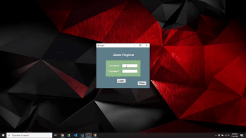

# GradeRegisterVB
# Purpose
Software Engineering Class: I was tasked to design and develop a CRUD program using VisualBasic with a SQL Database. I choose to build a GradeRegister.
## Description
This desktop application starts with a secured login. When accessed it allows the user to safely store their students grades in a database. Has a calculate (average grades), while also allowing access to all finalgrades where you may save them as PDF or print them.
#Includes
  * Login system
  * A Help section on each window.
  * Add,delete,update students by groups.
  * Add Max grades with dates by Group, and individual grades for each student.
  * Calculate averagegrade
  * Print,PDF students final grades.
## Quick Display runthrough

## What could have been done better?
  * Overall visual design.
  * Database relationships.

